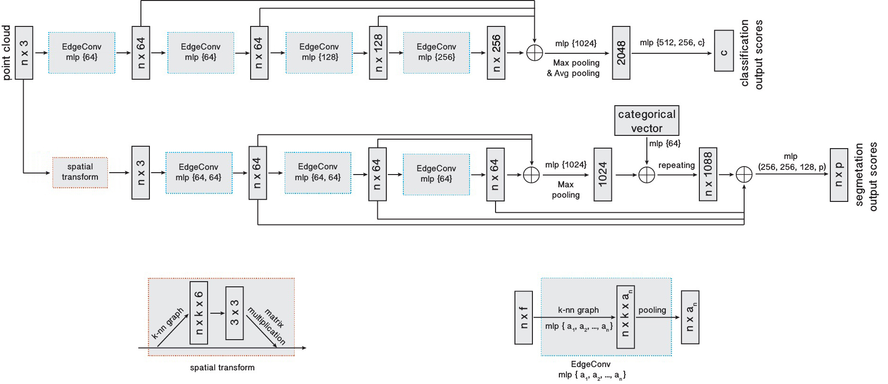

# 点云分割资料汇总

## 文献调研
### Dynamic Graph CNN for Learning on Point Clouds
| [code - 官方推荐第三方实现版本](https://github.com/AnTao97/dgcnn.pytorch) | [paper](https://arxiv.org/pdf/1801.07829.pdf) |
| ---- | ---- |

#### 网络结构图

